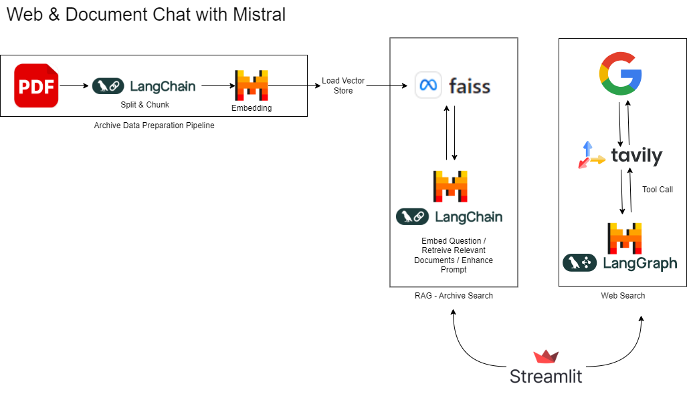

# Use Mistral to chat with the Web and a RAG/Archive 

This is a demonstration of a small-scale LLM application that can run a web search or retrieve documents from an archive and use that information to provide answers to a user for questions that likely go beyond the scope of the training data for the LLM.

This solution using Mistral models, hosted on La Plateforme, for generating embeddings as well as the conversational functionality.  Other technologies deployed include FAISS vector store, Tavily web search client, LangChain and LangGraph.  The user interface is implemented using Streamlit.

## Architecture

## Implementation Details

To run this example, complete the following steps:

1. Establish an account and setup an API Key for [Mistral La Plateform](https://mistral.ai/products/la-plateforme).

2. Establish an account and setup an API Key for [Tavily](https://app.tavily.com/home).

3. Create a .env file in the directory and add the API keys 
    * TAVILY_API_KEY=__<your_key>__
    * MISTRAL_API_KEY=__<your_key>__

4. Source 10 or so PDF articles with text content; add them to a "docs" folder in your working directory.

5. Required libraries are documented in Requirements.txt

6. Execute the Streamlit app from your working directory via `streamlit run WebRAGSearch_app.py`

Happy searching!